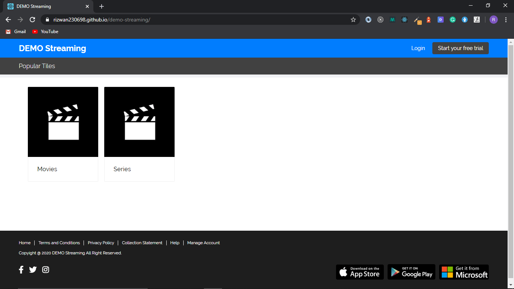
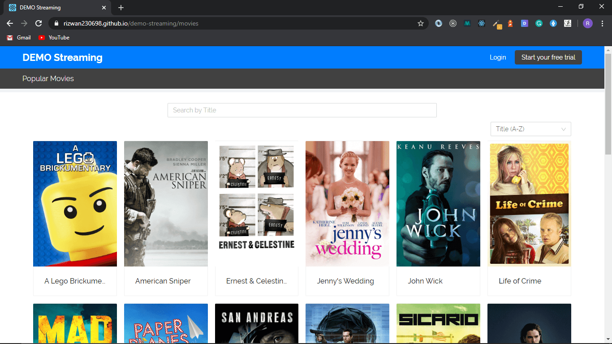
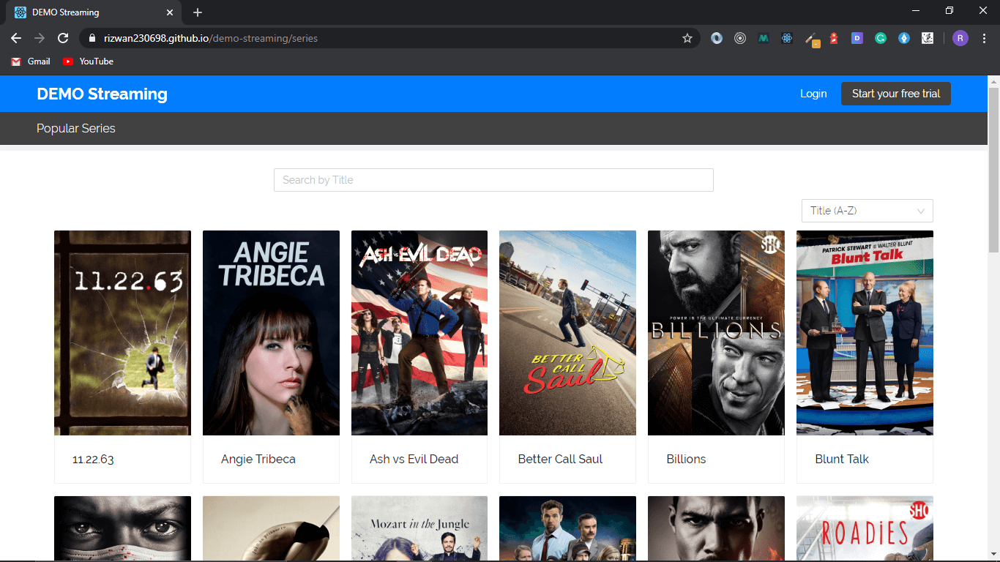

[Live Application Link](https://rizwan230698.github.io/demo-streaming/).

### Steps to run the app

1. Clone this repo.
2. Go to the project directory.
3. Run `yarn` or `npm install` to install the dependencies.
4. Run `yarn start` or `npm start` to run the application in the development mode.
5. Open [http://localhost/:3000](http//localhost:3000) to view it in the browser.

## How did you decide on the technical and architectural choices used as part of your solution?

I used react-router-dom because it is one of the most popular routing libraries and it's easy to use as well. I used Axios to make API calls because it is compatible with all the browsers. For the UI design, I used Ant Design and styled-components because Ant Design has a lot of components and it can be easily customized using styled-components.

## Are there any improvements you could make to your submission?

I could have tried to reuse components more and styled the UI more.

## What would you do differently if you were allocated more time?

I don't have much idea how to write tests for React App if I had more time I'd have learned it.

